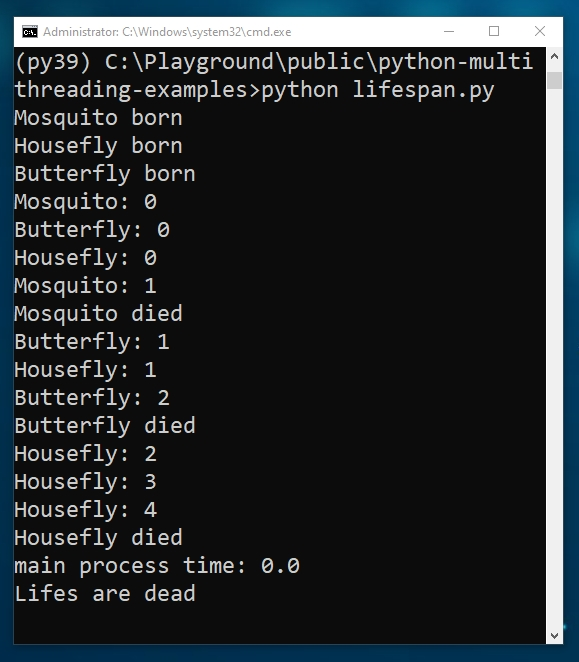

# Lifespan: Multithreading template
A simple example of Multithreading programming. This is a template for ones who want to start programming multithreading in Python.

`lifespan.py` result screenshot:

